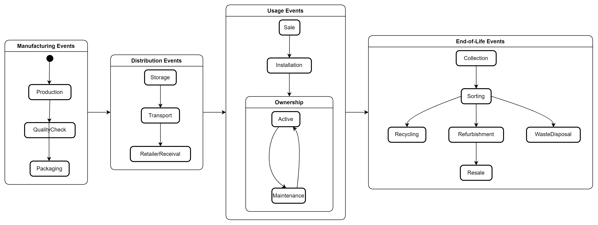

# Digital Product Passport (DPP) Data Model

## Overview
This document describes a simplified data model for Digital Product Passports in the context of circular economy. The model includes core entities, user types, access control, and lifecycle events tracking. The Digital Product Passport serves as a standardized way to collect and share product-related information throughout its lifecycle, supporting circular economy principles through improved transparency and traceability.

## Data Model

### Core Entities Overview
The data model is structured around the DPP entity which acts as a digital twin of the physical product. The DPP maintains critical metadata about the passport itself, while the PRODUCT entity holds the operational data. This separation allows for clear version control and access management while maintaining direct relationships between the product and its materials, certifications, lifecycle events, and service history.

Key features of the model:
- DPP serves as the digital passport layer focusing on metadata and access control
- PRODUCT is the central entity holding all operational data
- Direct relationships between PRODUCT and supporting entities for clear data organization
- Structured tracking of materials, events, certifications, and service history

#### DPP Entity
The DPP entity serves as the digital passport layer, focusing on metadata, versioning, and access control. It provides a one-to-one digital twin relationship with the product.

#### PRODUCT Entity
The PRODUCT entity acts as the central entity holding all operational data, directly linking to materials, lifecycle events, and certifications.

#### MATERIAL Entity
Tracks the composition and characteristics of materials used in the product, supporting recycling and environmental impact assessment.

#### LIFECYCLE_EVENT Entity
Records all significant events throughout the product's life, from manufacturing to end-of-life.

#### CERTIFICATION Entity
Maintains compliance and standards information throughout the product's lifecycle.

#### SERVICE_HISTORY Entity
Tracks maintenance, repairs, and other service-related activities separate from general lifecycle events.

## User Types and Access Control

The DPP system implements role-based access control to ensure that different stakeholders can access only the information relevant to their needs while maintaining data security and privacy. Each user type has specific permissions and responsibilities within the system.

[Figure: User Types and Access Control Diagram]

### Producer
The producer has primary responsibility for creating and maintaining the DPP throughout the manufacturing phase.
- Full access to product info, materials, and certifications
- Can create and edit all product details
- Can only view service history
- Primary actions: Create DPP, Update specifications, Add certifications

### End User
End users have access to information needed for product use and maintenance while protecting sensitive manufacturing details.
- Read access to product info and certifications
- Partial access to materials (basic info only)
- Can view service history
- Primary actions: View product details, Check certifications, Access user manual

### Recycler
Recyclers have detailed access to material information to ensure proper end-of-life processing.
- Full access to materials information
- Read access to product info and certifications
- No access to service history
- Primary actions: View material composition, Record recycling process

### Service Provider
Service providers can access technical information and maintain service records.
- Full access to service history
- Read access to product info and certifications
- Partial access to materials
- Primary actions: Record maintenance, Update service history

## Lifecycle Events

The lifecycle events tracking system provides a comprehensive record of a product's journey from manufacture to end-of-life. Each stage captures specific events relevant to circular economy principles and sustainability tracking.

### Manufacturing Events
Initial phase where the product and its DPP are created:

### Distribution Events
Tracks the product's journey through the supply chain:

### Usage Events
Monitors the product during its active use phase:

### End-of-Life Events
Records the final phase focusing on proper disposal and material recovery:

## Access Control Principles
The system implements graduated access levels to protect sensitive information while ensuring necessary data availability:
- Full access (🔓): Can view and edit all information
- Partial access (🔒): Can view limited information
- Read access (👁): Can only view information
- No access (⛔): Cannot view or edit

This structure ensures:
- Data privacy and security
- Role-appropriate access to information
- Clear separation of responsibilities
- Traceable actions by each user type